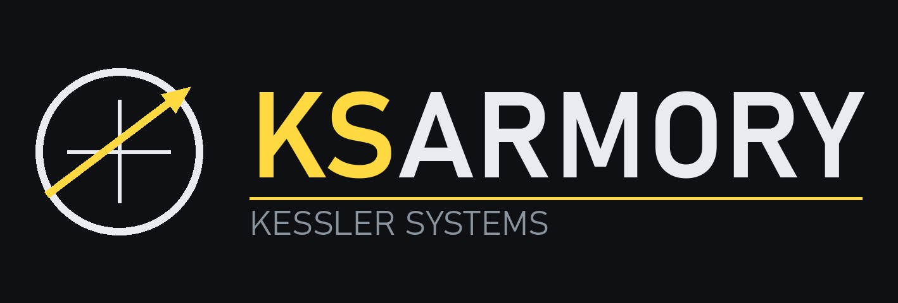

# KSArmory



Weapon systems for **[Kitten Space Agency](https://ahwoo.com/app/100000/kitten-space-agency)**
— sensors, fire control, guided and unguided rounds, and the parts to mount them on.

The mod provides the machinery a weapon needs and keeps it separate from any particular weapon:
a search sensor with a threat model, fire control that decides when to commit, articulated mounts
that traverse and elevate, projectiles flown to sub-frame accuracy, and an operator's panel.
**A weapon system is then a registry entry plus its art** — nothing in the simulation or the game
binding names a specific vehicle.

What that machinery gives any system built on it:

- **Search sensor** with a steerable range and cone, lock-on dwell, and manual designation
- **Threat classification by closest point of approach**, so a target merely *passing by* is
  engaged rather than only one closing head-on
- **Identification friend-or-foe** with teams, allies, neutrals and an engage-unknown policy
- **Guided rounds** — proportional navigation, so they *lead* a crossing target instead of
  chasing it — and **unguided ones**, with a ballistic lead solved by the mount
- **Proximity and contact fuses**, solved analytically within each sub-step so nothing tunnels
  through the trigger radius between frames
- **Articulated mounts** — traverse, elevation, independent pointing heads, with travel limits
  and interlocks against the vehicle's own bodywork
- Full ImGui panel, and in-world drawing of the search volume, tracks and rounds

## What ships with it

Seven weapon systems, each a different shape of launcher on the same machinery:

**Pantsir-S1 Point Defence System** — a buildable 8×8 vehicle carrying twelve missiles in two pods
of six, twin 30 mm autocannon, a tracking array, a spinning search radar, and an electro-optical
head you can watch through. The 57E6 missiles engage from 1.2 km out to 20 km; the 2A38M cannon
cover the close-in band beneath them, 200 m to 4 km. It stacks on a 3 m node rather than
surface-attaching — a part with any surface connector cannot be a craft's root — and it is its own
command source, so a craft consisting of nothing but the Pantsir builds and launches.

**LAU-7 Sidewinder rail** — a single rail carrying one AIM-9J, surface-attaching to anything.
Nothing on it moves: no turret, no pods, one round and no reload, so where it can shoot is decided
by how the craft is pointed. The round has a seeker of its own rather than a command link, so it
keeps guiding after the launcher loses the track. 400 m to 14 km.

**LAU-128 AMRAAM rail** — the same launcher again, carrying an AIM-120C-7 instead. Mechanically
identical to the LAU-7: nothing moves, one round, no reload. What differs is reach — a boost-only
motor to about Mach 4 and a long coast after it, so 900 m out to 105 km, and a shot taken at the
far end arrives slow and turns badly. Its body is the first round in the mod *authored* in Blender
rather than generated by a script, so it is unwrapped and its bands are painted rather than
modelled — the LITENING pod and the suspension rail it hangs from were authored before it.

**LAU-118 HARM rail** — the same rail once more, carrying an AGM-88, and the one that cannot
engage an aircraft at all: it homes on an emission, so a contact that is not transmitting is not a
target however large or close, and a radar site that goes quiet stops being one. Its motor boosts
and then sustains where the AMRAAM only boosts, so it still holds speed at the far end of a
1.2 km to 148 km envelope.

**Mk 15 Phalanx CIWS** — a close-in gun mount that stacks on a 3 m node and carries no missiles at
all. 1550 rounds of 20 mm at 4500 a minute, effective to 1486 m, with its radome elevating on the
same trunnion as the barrels so the track antenna stays boresighted with them. Elevation runs from
−25° to +85°.

**B61 bomb rack** — the one that neither aims nor fires: it lets a bomb go and the ground does the
rest. One B61-12 on a rack that surface-attaches to an aircraft, and a sight that draws the ring
the bomb will land in — flown rather than solved, so the ring sits wherever the round will actually
go. It ships at the bottom of the real yield range.

**MIRV bus** — six Mk 21 reentry vehicles on a post-boost vehicle that stacks on a 3 m node.
Nothing on it moves and nothing about it aims: the ballistic computer flies the whole stack, cuts
the engines on the solution, trims the bus back onto it with its own thrusters, and then lets the
warheads go one at a time. See [`docs/ICBM-GUIDANCE.md`](docs/ICBM-GUIDANCE.md).

Two sights come with them, and they are the same instrument on different mechanisms:

**EO Director** — a sight as a part in its own right, on a mast. It finds its own targets through
its own sensor and drives the view with no weapon involved, so a hull carrying nothing else is an
observation post. A launcher may carry one as well, and the Pantsir's turret roof does.

**Rafael LITENING pod** — that same sight on a roll-nod gimbal: the whole nose rolls about the
pod's centreline while the ball nods within it, and the picture is counter-rotated so what the pod
hangs from stays at the top of it.

A further weapon is an entry in the registry plus its art: see
[Adding a weapon system](#adding-a-weapon-system).

**Or it need not be in this mod at all.** A *weapon pack* is an ordinary KSA mod that declares a
dependency on KSArmory and hands it a file of definitions; KSArmory never looks for one and holds
no list of them. `KSArmory-example-mod` is a complete worked example — a Mk 82 bomb rack, which
used to ship here — and `docs/WEAPON-PACKS.md` is the reference.

> Built against KSA build `2026.8.22.5348`. KSA is pre-release and has no official code-modding
> API; this uses the community [StarMap](https://github.com/StarMapLoader/StarMap) loader and
> may need updating when the game does. The community
> [wiki](https://kittenspaceagency.wiki.gg/) is a useful reference for the game itself.

## Install

### What you need first

- **Kitten Space Agency.** Built against build `2026.8.22.5348`; a different build may need a
  rebuild of the mod. **Windows and Linux both work** — the mod is a portable .NET assembly with
  no native code, so the single release archive is the same on either.
- **[StarMap](https://github.com/StarMapLoader/StarMap/releases)**, the community mod loader.
  KSA has no official code-modding API, so nothing here runs without it. Edit its
  `StarMapConfig.json` to point at your KSA install — StarMap reads that file **relative to its
  own directory**, so it has to be launched from where it lives.

### Steps

1. **Get the mod.** Download `KSArmory-<version>.zip` from
   [Releases](../../releases), or build it yourself with `./tools/package.sh`.

2. **Unzip it into your mods folder.** That folder lives inside KSA's user directory:

   | Platform | KSA user directory |
   | --- | --- |
   | Windows | `Documents\My Games\Kitten Space Agency\` |
   | Linux | wherever KSA keeps its user data — commonly `~/.local/share/Kitten Space Agency/`; the folder containing `manifest.toml` and `Logs/` is the one you want |
   | Proton / Wine | inside the prefix, at `.../drive_c/users/steamuser/Documents/My Games/Kitten Space Agency/` |

   You should end up with:

   ```
   <KSA user directory>/mods/KSArmory/
     KSArmory.dll
     mod.toml
     KSArmory{Assets,GameData,Particles,Sounds,Characters}.xml
     KSArmory/Weapons.xml
     Meshes/*.glb
     Textures/*.png
     Sounds/*.wav
   ```

   The folder layout matters, and on Linux so does the **case**. `KSArmoryAssets.xml` refers
   to `Meshes/` and `Textures/` by relative path; a case mismatch is silently tolerated on
   Windows and fails on Linux. Unzip rather than retyping the names.

3. **Register it in `manifest.toml`.** This step is required — *dropping the folder in is not
   enough*. Open `manifest.toml` in the same user directory and add:

   ```toml
   [[mods]]
   id = "KSArmory"
   enabled = true
   ```

   KSA discovers mods through that list, and StarMap walks the same list to find code mods.
   Without an entry, nothing loads and nothing tells you why.

4. **Launch through StarMap, not the game directly.** Starting KSA directly bypasses the loader
   entirely: the part will still appear in the editor, but none of the behaviour will run.

   On Windows that is `StarMap.exe`. StarMap also ships `StarMap.dll` — a portable .NET
   assembly — so on Linux `dotnet StarMap.dll` from the same folder is the equivalent. Either
   way it must run from its own directory, because it reads `StarMapConfig.json` relative to
   itself.

### Check it worked

The mod writes its own log to `Logs/KSArmory.log` under the KSA user directory, and prints
the path it chose to stdout on startup — handy if it ended up somewhere unexpected. The file is
truncated each session. You should see:

```
loading (mod id: KSArmory)
ready - Pantsir-S1, LAU-7 Sidewinder rail, ..., safe. Open the 'KSArmory' panel to arm.
```

The `ready` line arrives roughly **20 seconds after** the first, because the loader waits for
the game to finish loading. That delay is normal, not a hang.

Then: build a craft with the **Pantsir-S1 Point Defence System** (under *Weapons*), launch,
and the **KSArmory** panel appears once you are in flight.

### If it doesn't

| Symptom | Cause |
| --- | --- |
| No `KSArmory.log` at all | StarMap never ran the mod. Check the `manifest.toml` entry, and that you launched `StarMap.exe`. |
| Part missing from the editor | The asset XML did not load. `KittenSpaceAgency.log` is where XML and asset errors appear. |
| Part is there but nothing happens in flight | The DLL did not load, but the XML did — check `mod.toml`'s `EntryAssembly = "KSArmory"` matches the DLL name. |
| Part renders untextured or invisible | `Meshes/` or `Textures/` did not come across, or the folder layout was flattened. |
| Panel says `no weapons system on this craft` | The part is not on the craft you are flying, or its Id did not match a registered launcher. |
| Works on Windows, part untextured on Linux | A case mismatch in a file or folder name. Linux filesystems are case-sensitive; Windows is not. Re-unzip rather than renaming by hand. |

Developing rather than just playing? `./tools/deploy.sh` builds, installs and registers the mod
in one go — including the `manifest.toml` entry.

## Use

1. In the editor, attach the **Pantsir-S1 Point Defence System** to your craft. It is under
   *Weapons* and stacks on a 3 m node. It is also its own command source, so a craft consisting of
   nothing but the Pantsir builds and launches.
2. In flight, tick **Master arm**. Nothing launches while it is safe.
3. Tick **Auto engage** to let it fire on its own, or leave it off and use **FIRE** against the
   current lock.
4. A system stays on the craft carrying its launcher whatever you take control of, so you can
   switch away and watch it defend itself.

The launcher **traverses and elevates onto the target**, and will not fire until it has settled
on the aim point. The radar's own boresight stays local "up" — a hemisphere is what you want for
a defence site. Green dots mark loaded tubes, grey ones spent.

**Missiles** and **Cannon** can be armed independently. The cannon engage inside 4 km, overlapping
the missiles' 1.2 km minimum so nothing can sit in a gap between them, and the mount solves a
ballistic lead for them rather than pointing straight at the contact. Set **Director view** to
*main view* to look through the tracker, which borrows the player's own camera and hands it back.
A second camera window is offered too and renders without KSA's atmosphere pass, so that one has
no sky. See [`docs/BLOCKED-ON-KSA.md`](docs/BLOCKED-ON-KSA.md).

A contact becomes a *threat* when its closest point of approach falls inside **Threat radius**
within **Threat horizon** seconds. It becomes shootable once held for **Lock time**. The
launcher commits **Rounds per target** rounds before re-evaluating.

### Tuning that actually matters

| Setting | Effect |
| --- | --- |
| **Nav constant N** | 3–5 is the realistic band. Higher leads harder and pulls more g; too high oscillates. |
| **Max lateral g** | The airframe limit. Drop it and fast crossing targets start escaping. |
| **Seeker FOV** | How far off its own nose the round can still see. Narrow means broken locks on hard crossers. |
| **Fuse radius** | Trigger distance. Larger is more forgiving; it does not increase lethality. |
| **Explosive charge** | What actually kills. Lethal and blast radius are both read off it by the cube root, so doubling it multiplies the reach by 1.26. Between the two the target survives. |
| **Gravity compensation** | 1.0 makes guidance ignore the fall. Drop it for lobbed, ballistic-looking shots. |

## Testing

The system works end to end in game: the part loads and renders, the launcher tracks, missiles
intercept at 16–20 m, and the cannon kill at 6–8 m. [`CHECKLIST.md`](CHECKLIST.md) walks through
what is confirmed and what is still open, in risk order.

`./tools/test.sh` runs the headless suite — whole engagements at ecliptic speeds, the drives,
launch and lead geometry, the fuses and the registry — with no game present.
`./tools/model/checkswept.py` sweeps the mount through its travel and reports any assembly that
comes adrift or passes through another, needing neither Blender nor the game.

## Build

Requires the **.NET 10 SDK** — the mod targets `net10.0` because that is what KSA runs on.
Distro packages are usually still .NET 8, which fails with `NETSDK1045`. The scripts below
resolve an SDK from `~/.dotnet` automatically; `source tools/env.sh` if you want bare `dotnet`
to work in your shell.

```bash
./tools/sync-import.sh                 # copy game assemblies into Import/
./tools/build.sh                       # build the mod
./tools/test.sh                        # guidance and fuse tests, no game required
./tools/validate-parts.py              # check asset Ids, texture paths and launch geometry
./tools/deploy.sh                      # build and install into the mods folder
```

The model is committed, so a plain build does not need Blender. Rebuild it with
`./tools/model/build.sh` — see [`tools/model/README.md`](tools/model/README.md).

### Releasing

Releases are cut automatically by [semantic-release](https://semantic-release.gitbook.io/) when
something lands on `main`: it reads the Conventional Commits since the last tag, works out the
version, writes `CHANGELOG.md`, stamps the version into the project file, tags and publishes a
GitHub Release. No version number is ever edited by hand.

Building the archive needs KSA's assemblies, which CI gets from a private repository (see
below), so the second job builds and attaches it automatically. If that is ever unavailable the
release is still cut, just without a binary — attach one from a machine that has KSA:

```bash
./tools/publish-release.sh            # build and attach to the release for the current version
./tools/publish-release.sh v0.2.0     # ...or a specific tag
```

Or build the archive alone:

```bash
./tools/package.sh                     # dist/KSArmory-<version>.zip
./tools/package.sh --version 1.2.0     # override the version
```

#### What bumps what

`feat`, `fix` and `perf` all cut a **patch**. Minor versions are never automatic — tag one by hand
when something genuinely lands:

```bash
git tag -a v0.9.0 -m "second weapon system"
git push origin v0.9.0
```

semantic-release reads the newest tag and carries on from it, so the next `fix` after that is
`0.9.1`.

Tags are what anchor the whole sequence: semantic-release treats "no tags" as "no releases" and
publishes `1.0.0`, whatever the project file says.

#### Going 1.0.0

When it is ready, tag it by hand and let automation carry on from there:

```bash
git tag -a v1.0.0 -m "1.0.0"
git push origin v1.0.0
./tools/set-version.sh 1.0.0    # optional; the next release rewrites it anyway
```

The next `feat` after that gives `1.1.0`, the next `fix` `1.0.1`.

A `BREAKING CHANGE:` footer would also promote `0.x` straight to `1.0.0`, since that is what
semver says a major bump means. Worth knowing so it does not happen by accident before you
intend it — while pre-1.0, a breaking change is usually better expressed as a `feat`.

Release builds carry no debug symbols and start the log at `INFO` instead of `DEBUG`; tick
**Verbose log** in the panel to get the detail back when reporting a bug. The script refuses to
ship a `.pdb` or any assembly that is not ours.

> **CI needs KSA's assemblies, and they are not redistributable.** They live in a private
> repository and are checked out with a read-only deploy key held in the `KSA_ASSEMBLIES_KEY`
> secret — keeping your own licensed copy privately is fine, publishing it is not. Forks without
> the secret still get the tooling job: mesh checks, the `Sim/` boundary guard, case-exact asset
> paths, texture reproducibility, shellcheck and XML validation.

On WSL you can also drive the whole loop from the terminal:

```bash
./tools/setup-starmap.sh               # one-off: install StarMap, point it at KSA
./tools/run.sh                         # build, deploy, launch; mod output streams back
```

No .NET 10 SDK yet?

```bash
curl -sSL https://dot.net/v1/dotnet-install.sh | bash -s -- --channel 10.0 --install-dir $HOME/.dotnet
```

`Import/` is gitignored — it holds the game's own binaries, which are not redistributable.
`sync-import.sh` reads them from your install (override with `KSA_DIR=...`).

`StarMap.API.dll` comes from a StarMap release rather than the game; drop it into `Import/` or
pass `STARMAP_DIR=...`.

## How it works

**Four of the parts are generated rather than authored.** The Pantsir, the LAU-7 rail, the CIWS
and the EO director have no `.blend` file: `tools/model/pantsir.py` builds them out of primitives
in headless Blender and exports the mesh atlas, while `palette.py` writes the textures as a grid of
flat swatches that every face is UV-mapped into. One command rebuilds all of it:

```bash
./tools/model/build.sh
```

It also renders previews, so a shape can be judged without the game — build, look, adjust, repeat
— and prints the launch geometry as a block to paste into the profile.
`tools/validate-parts.py` fails if a profile and the mesh ever disagree about where the tubes are,
and checks every asset Id and texture path, because all of those fail silently in-game.

Everything since is **authored** in Blender and its `.blend` is not in this repository, so a
committed asset cannot be rebuilt from a clean checkout — which is why `checkmesh.py` and
`validate-parts.py` matter more for those than for the generated four.

The part itself is inert — KSA sees structure with mass and a collider. The C# mod finds it on
the vehicle and mounts the battery there. That split avoids registering a custom module type
into the engine's internal update lists, which is not reachable without patching.

**Adding a weapon system is data, not code.** `src/KSArmory/Sim/Arsenal.cs` registers each
launcher, round and sensor as a profile; discovery is by part Id, so nothing in the simulation
or the game binding names a particular vehicle. A new system is an entry there plus its art.

The source is split by whether it can see KSA at all: `Sim/` cannot, `Ksa/` does. The test
project links all of `Sim/` and references no game assembly, so the boundary enforces itself —
reach for a KSA type in `Sim/` and the tests stop compiling.

Rounds are simulated by the mod rather than being spawned as KSA vehicles. That gives
sub-frame integration accuracy — at 2 km/s of closing speed a single frame covers ~67 m, far
more than any sensible fuse radius — and keeps the mod from touching your save. They are still
*drawn* as real geometry: each round is a subpart of the launcher, hidden until fired and then
flown by writing its transform every frame.

Guidance is textbook true proportional navigation. With line-of-sight rate
`ω = (r × v) / (r · r)` and closing velocity `Vc = -v`, the commanded acceleration is
`a = N · (ω × Vc)`. Nulling the line-of-sight rotation puts the round on a collision triangle,
which is what makes it lead. Gravity is biased out, the command is projected perpendicular to
the flight path, and it is clipped to the structural g limit.

The fuse solves for closest approach analytically within each sub-step
(`t = -r·v / v·v`, clamped to the step) rather than sampling distance, so nothing tunnels
through the trigger radius between frames.

See [`docs/KSA-MODDING-NOTES.md`](docs/KSA-MODDING-NOTES.md) for the reverse-engineered game
API this is built on.

## Limitations

- The radar's search volume does not follow the turret. Where it points is a per-system setting —
  local "up", the launcher's own facing, or the tubes — but never the current aim.
- A *secondary* camera window driven by the optical head has no sky, clouds or terrain detail:
  KSA renders secondary viewports without the atmosphere pass. That is why the head borrows the
  player's own view instead. [`docs/BLOCKED-ON-KSA.md`](docs/BLOCKED-ON-KSA.md) has the mechanism
  and what would change it.
- The wheels are geometry. KSA has no wheel or suspension module, so the vehicle is placed rather
  than driven.
- Rounds hit terrain only where their profile asks for it, because it costs a height sample per
  round per frame and a CIWS burst is 150 shells: the bomb and the reentry vehicle do, so a shell
  still passes through a hill and a missile that misses carries on into space. Structures are not
  collided with at all.
- The radar can mask against the real skyline and ships not doing it. `TerrainSamples` is the
  number of height lookups one contact may cost and defaults to zero, which is the body's mean
  sphere alone — so a craft behind a ridge is still seen until it is turned up.
- Damage is binary. KSA exposes no partial-damage model, only outright destruction.

## Contributing

Issues and pull requests welcome. **[`CONTRIBUTING.md`](CONTRIBUTING.md) is the short version** —
what you need, what you don't, and the handful of rules that are not style preferences.

The quickest start on any platform:

```bash
./tools/doctor.sh   # checks this machine and prints the fix for anything missing
```

**Work goes on `dev`. `main` is the release branch.** A push to `main` cuts a release and
publishes it to SpaceDock, so branch off `dev`, open pull requests against `dev`, and push there as
often as you like — CI runs on every branch and every pull request, so the build, the tests and the
other twenty checks gate each push either way. Releasing is then a deliberate act: `dev` is merged
into `main` and semantic-release cuts one release covering everything that accumulated. It is a
merge rather than a squash, because the changelog is built from the individual commit subjects.

Worth knowing up front: **most of this repository is testable without launching the game.**
Everything under `src/KSArmory/Sim/` is free of KSA types by construction, so guidance, threat
classification, tube geometry and the fuse can all be worked on headlessly. Building it still
needs KSA's assemblies — `double3` comes from `Brutal.Core.Numerics.dll` — which is what
`./tools/doctor.sh` checks for first.

The rest of this section is the longer version.

### Read `CLAUDE.md` first

It is the working notes for this repo: the environment traps, the design decisions worth not
re-litigating, and the failure modes that are invisible from the code alone.
[`docs/KSA-MODDING-NOTES.md`](docs/KSA-MODDING-NOTES.md) is the reverse-engineered API
reference — reference frames, the loader contract, part XML.

### Setting up

```bash
./tools/install-hooks.sh   # commit-msg hook, so a bad message is caught before it exists
./tools/sync-import.sh     # copy KSA's assemblies into Import/ (gitignored, not redistributable)
                           # ...or skip it: the build also finds a local KSA install by itself
./tools/build.sh           # needs .NET 10; a distro dotnet 8 fails with NETSDK1045
./tools/test.sh            # the full suite, no game required
```

The wrapper scripts exist because bare `dotnet` picks up the system SDK and cannot target
`net10.0`. `source tools/env.sh` once if you want `dotnet` to work directly in your shell.

After a KSA update the assemblies CI builds against have to be refreshed too, or it silently
compiles the mod against a different game from the one you are testing on. `ksa-assemblies.lock`
records which build is expected and both CI and `sync-import.sh` check it — see the "After a KSA
update" section of [`CLAUDE.md`](CLAUDE.md) for the four commands.

### Commit messages

Releases are automatic, so commit messages are the input to versioning. Use
[Conventional Commits](https://www.conventionalcommits.org/):

```
feat(turret): elevate the pods on their trunnions
fix(rounds): anchor bodies to the tube they left, not the orbit position
docs: write an install guide
```

| Prefix | Effect on the version |
| --- | --- |
| `feat:`, `fix:`, `perf:`, `build:`, `revert:` | patch — `1.2.3` → `1.2.4` |
| any type with `!` or a `BREAKING CHANGE:` footer | major — `1.2.3` → `2.0.0` |
| `docs:`, `test:`, `chore:`, `ci:`, `style:`, `refactor:` | no release |
| a minor — `1.2.3` → `1.3.0` | never automatic; tag it by hand |

`feat` cutting a patch is deliberate. The type says what a change *is*, for the changelog; how big
a bump it earns is a separate decision, and a mod's routine flow of features, enhancements and
fixes together should not push the middle digit every time.

`docs` and `refactor` still appear in the changelog; they just do not cut a release on their
own. A commit that does not parse is treated as no release — so a stray `wip` will not publish
anything, but it will also vanish from the changelog without saying so. That silence is why the
format is enforced rather than merely suggested:

- **Locally**, `./tools/install-hooks.sh` enables a `commit-msg` hook that rejects a bad message
  before the commit exists. `git commit --no-verify` bypasses it for a one-off.
- **In CI**, the same script checks every commit in a push or pull request.

Both run `tools/check-commit-msg.sh`, so they cannot disagree about what is legal.

### Before opening a PR

```bash
./tools/check-all.sh          # everything CI runs, about 8 seconds
```

One script, and CI calls the same one, so they cannot disagree about what "the checks" are.
`--list` names them; `--with-sweep` adds the ~43 s drive sweep.

Checks needing the game assemblies are skipped with a notice rather than failed, so this is
worth running without a KSA install. On a fork the `tooling` job runs in full — it needs no
secret — and only the `build` job is gated, skipping with a notice.

`./tools/install-hooks.sh` also wires it to `pre-push`.

### How the code is laid out

`src/KSArmory/` splits by whether a file can see the game:

- **`Sim/`** — pure simulation and data. Guidance, the turret drives, launch geometry, and the
  weapon profiles. The test project links this folder wholesale and references no KSA assembly,
  so **reaching for a KSA type here breaks the test build**. That is deliberate: it is the only
  reason any of this is testable without the game running.
- **`Ksa/`** — everything that binds to KSA. Keep new game contact funnelled through `KsaWorld`
  where you can; the API moves between builds and one file is easier to fix than ten.

If something in `Ksa/` turns out to have real maths inside it, move the maths into `Sim/` rather
than leaving it unverifiable. `FireGeometry` is the worked example: launch angles are testable
because they live there rather than inside `LauncherPart`.

### Adding a weapon system

It is data, not code. Nothing in `Sim/` or `Ksa/` names the Pantsir.

1. Model it — authored in Blender, following `.claude/skills/ksa-blender/SKILL.md`. The headless
   generator builds the four parts that predate that and is not extended.
2. Declare the part in `KSArmoryAssets.xml` and `KSArmoryGameData.xml`.
3. Register a `LauncherProfile` in [`src/KSArmory/Sim/Arsenal.cs`](src/KSArmory/Sim/Arsenal.cs),
   naming the munition and sensor it uses. Add a `MunitionProfile` if the round differs.
4. And a `ComponentProfile` in `Arsenal.Components`. Without it the launcher loads, resolves its
   tubes and is then completely invisible — the panel says there is no weapons system on the craft
   and nothing appears in any log.

Discovery is by part Id, so the system picks up whatever is fitted. A launcher that cannot
train is the same profile with `TurretMarker` left null.

### Traps worth knowing about

- **Ecl is absolute.** Positions near Earth are ~1.5×10¹¹ m and sweep past at ~29.8 km/s, so an
  ecliptic value read as a local one is wrong by kilometres. Never orient or measure anything
  with `VelocityEcl` — use the frame-relative velocity.
- **Two instants, on purpose.** `DrawAnchor` samples the render position this frame and the
  geometry's position one update earlier. Collapsing them looks like a tidy-up and puts the
  whole overlay 500 m from the craft. `DrawAnchorTests` fails if they are collapsed.
- **Model defects are invisible in Blender.** Coplanar faces and zero-area UVs both render fine
  in a preview and make the vehicle crawl with flickering speckle in game. `checkmesh.py`
  catches both — run it, do not trust your eyes.
- **Bad asset Ids fail silently.** No log line, no error; the part just renders wrong.
  `validate-parts.py` is the only thing that will tell you.

### Style

Match what is there. Comments explain *why*, especially where the obvious approach is wrong —
several of the files carry a note saying "do not simplify this", and those notes are load-bearing.

## Licence

[MIT](LICENSE).

That covers everything in this repository: the C# mod, the tooling, and the art, all of which is
generated or authored here. The one thing that came from outside is the cannon recording under
`tools/audio/`, which is CC0 and carries no condition on redistribution — see the README beside
it.

It does **not** cover Kitten Space Agency itself. The mod compiles against KSA's assemblies but
never redistributes them: `Import/` is gitignored, the project references them with
`Private=false`, and `tools/package.sh` refuses to build an archive containing any DLL but its
own. You need your own copy of the game.

Not affiliated with or endorsed by RocketWerkz.
