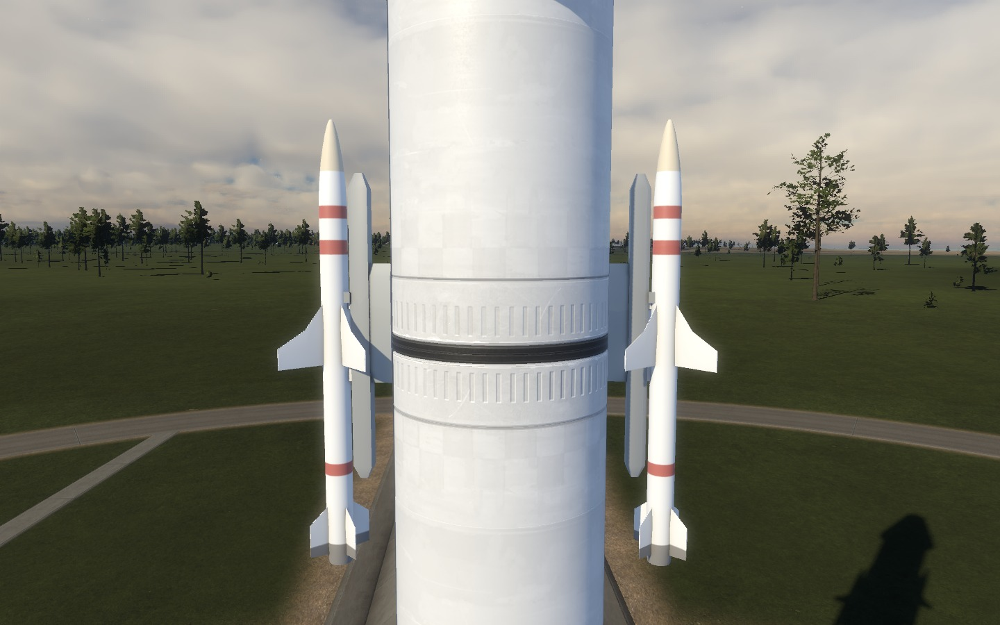
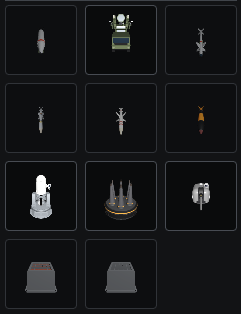
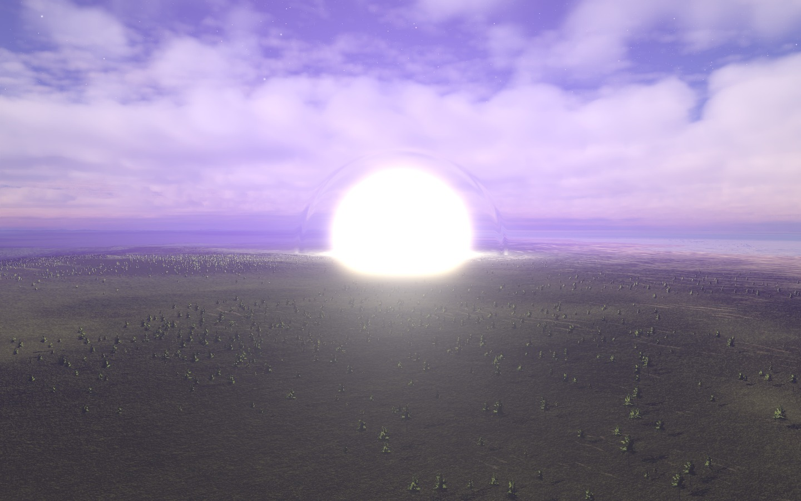

Adds working weapon systems to Kitten Space Agency. Every launcher searches, tracks, decides and shoots on its own, and the rounds are simulated by the mod rather than by the vehicle physics, so guidance runs at sub-frame accuracy and cannot corrupt a save.

### Launchers

A **Pantsir-S1** on an 8x8 chassis: search radar, twelve proportional-navigation interceptors in two pods of six, twin cannon, and a turret that traverses and elevates. A **Mk 15 Phalanx CIWS** that stacks on any 3 m node and carries no missiles at all. Three rails that surface-attach to anything: **LAU-7** with an AIM-9J, **LAU-128** with an AIM-120C, and **LAU-118** with an AGM-88 HARM, which homes on radar emissions and cannot engage an aircraft. A **B61 rack** that neither aims nor fires - it lets a bomb go and the ground does the rest.

### Sights

An **electro-optical director** on a mast and a **Rafael LITENING pod** whose whole nose rolls about its centreline while the sight nods within it. Both drive the main view, magnify by rewriting the field of view, and work on a craft carrying no weapons at all - a hull with one director on it is an observation post.

### Fire control

Threat classification is by closest point of approach rather than closing speed, so targets passing by are engageable and not only ones flying straight at you. IFF is per installation, so two sites can be on opposite sides. A radar can be told to go silent, which is a trade rather than a free defence: a silent set cannot be homed on and cannot see. Rounds can themselves be shot down.

### Ballistic computer

Aim a multiple-warhead ballistic missile at a point on any body and it flies itself: ascent, guided cutoff on velocity-to-be-gained, post-boost trim, and a warhead bus that releases each round along the same line. It picks up from wherever the vehicle already is - on the pad, mid-ascent, or in orbit, where it also decides *when* to leave.

### Effects

Detonations, nuclear fireballs and mushroom clouds standing in the world, motor plumes and smoke trails, tracers, muzzle flashes and spatialised gunfire, all through the engine's own renderers.
